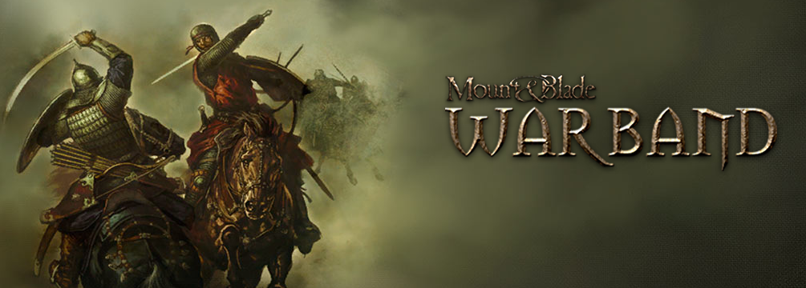

# Tradução para Mount and Blade

   Tradução para português brasileiro

## Instalação

 + Baixe a release, Vá na steam e botão direito no jogo e vá em gerenciar arquivos localmente
 + Copie os arquivos do diretório `languages\es` para o diretório `languages\es` e `Modules\Native\Language\es` para o `Modules\Native\Language\es` dentro do diretório de instalação do jogo.
 + Configure o jogo para espanhol, no menu do jogo

## Estado Atual

 + Interações
	+ Hints 10%
	+ UI 50%
	+ UI main 30%
 + Dialogos e Quest's 80%
